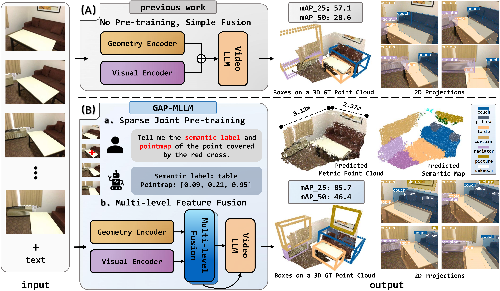

# GAP-MLLM: Geometry-Aligned Pre-training for Activating 3D Spatial Perception in Multimodal Large Language Models

<div align="center">

[Jiaxin Zhang](https://zestfuljx.github.io/)<sup>1</sup>, [Junjun Jiang📧](http://homepage.hit.edu.cn/jiangjunjun)<sup>1</sup>, Haijie Li<sup>2</sup>, Youyu Chen<sup>1</sup>, [Kui Jiang](http://homepage.hit.edu.cn/jiangkui)<sup>1</sup>, [Dave Zhenyu Chen](https://daveredrum.github.io/)<sup>3</sup>

<sup>1</sup>Harbin Institute of Technology, <sup>2</sup>Peking University, <sup>3</sup>Huawei


<a href="https://gapmllm.github.io/"></a>
<a href="https://arxiv.org/abs/2603.16461"></a>
<a href="https://huggingface.co/Zestfuljx0402/gapmllm-3d-3b"></a>

---
</div>

**TL;DR:** GAP-MLLM is a geometry-aligned pre-training paradigm that activates 3D spatial perception in RGB-only MLLMs. It uses sparse geometry-semantics joint pre-training and multi-level gated fusion to better exploit implicit geometric priors from reconstruction models.

<p align="center">
  
</p>


## Installation

1.  **Clone this repository.**

    ```bash
    git clone https://github.com/ZestfulJX/GAP-MLLM.git
    cd GAP-MLLM
    ```

2.  **Create a conda environment.**

    ```bash
    conda create -n gap-mllm python=3.10 -y
    conda activate gap-mllm
    ```

3.  **Install PyTorch for your hardware first.** 
   
    The current training scripts are configured for Ascend NPU and use `torch_npu`; install the matching `torch`, `torch_npu`, and CANN runtime before training.

    ```bash
    pip install torch==2.5.1 torchvision==0.20.1 torchaudio==2.5.1
    ```

4.  **Install this project.**

    ```bash
    pip install -e .
    ```

5.  **Optional: install PyTorch3D for demo and evaluation.**

    ```bash
    git clone https://github.com/facebookresearch/pytorch3d.git
    cd pytorch3d
    pip install -e .
    cd ..
    ```

## Run Demo

We provide a 3D video object detection demo under `demo/3d_video_object_detection`.

Before running, update the [checkpoints](https://huggingface.co/Zestfuljx0402/gapmllm-3d-3b) path in `demo.py`:

```python
pretrained = "ckpts/gapmllm-3d-3b"
```

Then run:

```bash
python demo.py
```

## Data Preparation

### 1. Structure

Before starting the training or evaluation process, you need to download the required datasets and annotations according to the following folder structure.

```text
data
|-- evaluation
|   |-- recons
|   |-- scan2cap
|   |-- scanrefer
|   `-- threedod
|-- media
|   `-- scannet
`-- train
    |-- scan2cap_train_32frames.json
    |-- scannet_det_train_4frames.json
    |-- scannet_recons_train_4frames.json
    |-- scanrefer_train_32frames_stage1.json
    `-- scanrefer_train_32frames_stage2.json
```

### 2. Data for 3D Scene Understanding

- **Annotations:** Download the annotation files from [GAP-MLLM-Data](https://huggingface.co/datasets/Zestfuljx0402/GAP-MLLM-Data).
- **Media Data:** Prepare preprocessed video frames following the instruction of [VG-LLM](https://github.com/LaVi-Lab/VG-LLM), and place them under `data/media`.


## Run Inference and Evaluation

We provide two checkpoints: [gapmllm-pretraining-3b](https://huggingface.co/Zestfuljx0402/qwen3-gapmllm-pretraining-3b) is the geometry-aligned pre-training checkpoint for 3D reconstruction, and [gapmllm-3d-3b](https://huggingface.co/Zestfuljx0402/gapmllm-3d-3b) is the 3D object perception checkpoint for 3D object detection, dense captioning, and visual grounding.

3D video object detection:

```bash
python inference_det.py \
    --ckpt_path ckpts/gapmllm-3d-3b \
    --data_path data/media \
    --output_path outputs/det
```

3D dense captioning:

```bash
python inference_cap.py \
    --ckpt_path ckpts/gapmllm-3d-3b \
    --data_path data/media \
    --output_path outputs/cap
```

3D visual grounding:

```bash
python inference_vg_two_stage.py \
    --ckpt_path ckpts/gapmllm-3d-3b \
    --data_path data/media \
    --output_path outputs/scanrefer
```

3D reconstruction:

```bash
python inference_recons.py \
    --ckpt_path ckpts/gapmllm-pretraining-3b \
    --data_path data/media \
    --output_path outputs/recons
```

## Training

GAP-MLLM follows a two-stage training pipeline. We first conduct geometry-aligned pre-training to activate the model's 3D spatial perception ability, and then fine-tune it on downstream object-level 3D scene understanding tasks.

**Stage 1: Geometry-Aligned Pre-training**


```bash
bash scripts/train/train_pretraining.sh
```

**Stage 2: Object-Level Fine-tuning**


```bash
bash scripts/train/train_3d.sh
```

**Training Details**

Our models are built upon Qwen3-VL-3B and integrated with VGGT-1B as the 3D geometry encoder. During training, the visual encoder and geometry encoder are frozen, while the LLM backbone and multi-level fusion modules are optimized.

Please update `MODEL_PATH`, `GEOMETRY_ENCODER_PATH`, and `NPROC_PER_NODE` in the scripts before training.

## Acknowledgement

This repository builds on several open-source projects and datasets, including:

[Qwen3-VL](https://github.com/QwenLM/Qwen3-VL)
[VGGT](https://github.com/facebookresearch/vggt)
[VG-LLM](https://github.com/LaVi-Lab/VG-LLM)
[EmbodiedScan](https://github.com/OpenRobotLab/EmbodiedScan)

Many thanks to these authors.

## Citation

If you find this work useful, please cite:

```bibtex
@misc{zhang2026gapmllm,
      title={GAP-MLLM: Geometry-Aligned Pre-training for Activating 3D Spatial Perception in Multimodal Large Language Models}, 
      author={Jiaxin Zhang and Junjun Jiang and Haijie Li and Youyu Chen and Kui Jiang and Dave Zhenyu Chen},
      year={2026},
      eprint={2603.16461},
      archivePrefix={arXiv},
}
```
